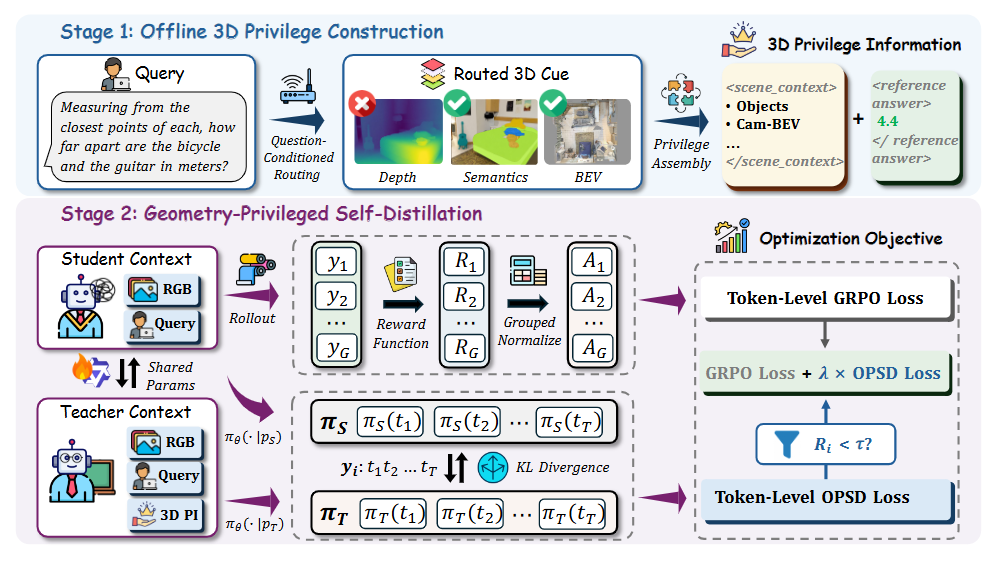
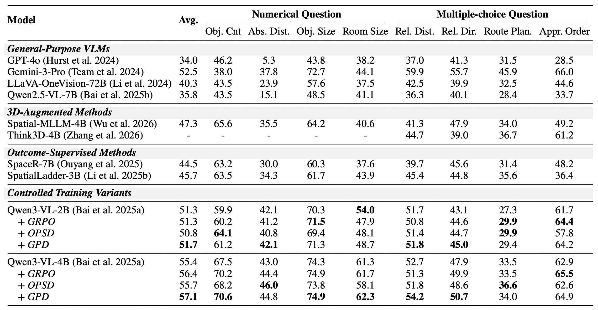
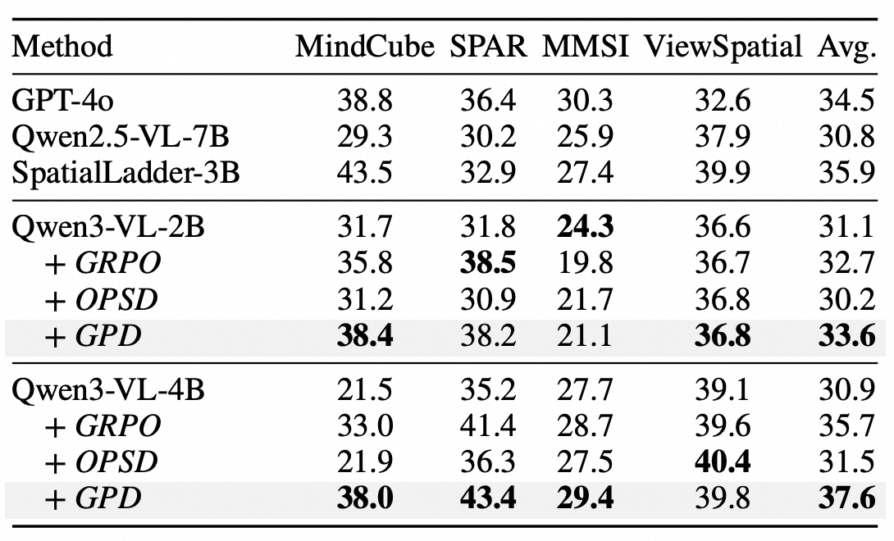

# GPD: Distilling Routed 3D Privilege for Spatial Reasoning in Vision-Language Models

<p align="center">
  <a href="https://arxiv.org/abs/2610.12355"></a>
  <a href="https://huggingface.co/xinyili0624/GPD-2B"></a>
  <a href="https://huggingface.co/xinyili0624/GPD-4B"></a>
  <a href="https://huggingface.co/datasets/xinyili0624/GPD-15k"></a>
</p>

## 🔥 Overview

We introduce **GPD** (*Geometry-Privileged Distillation*), which makes question-routed 3D geometry the privilege in on-policy self-distillation. The student sees only RGB frames and the question; the teacher (same model) additionally sees routed textual cues from **depth / semantic / BEV** plus the reference answer. A privileged KL on **incorrect trajectories** augments GRPO, and the deployed model stays **RGB-only**.

<p align="center">
  
</p>

On Qwen3-VL-4B, GPD reaches **57.1** on VSI-Bench and **37.6** average across MindCube, SPAR-Bench, MMSI-Bench, and ViewSpatial, outperforming both GRPO and answer-privileged OPSD.

<p align="center">
  
  
</p>

## 🗞️ News

- **`2026-10`**: We release the code, the [Mixed-15k training data](https://huggingface.co/datasets/xinyili0624/GPD-15k), and the [GPD-2B](https://huggingface.co/xinyili0624/GPD-2B) / [GPD-4B](https://huggingface.co/xinyili0624/GPD-4B) checkpoints.

## 🛠️ Installation

### Python environment

```bash
conda create -n gpd_rl python=3.11 -y
conda activate gpd_rl

git clone https://github.com/ZJU-REAL/GPD.git
cd GPD
bash scripts/setup.sh
```

`setup.sh` installs dependencies from `EasyR1/requirements_b200.txt`, CUDA PyTorch wheels, `flash-attn`, and `pip install -e .` for EasyR1.

Download the backbone (not shipped) and point to it:

```bash
export MODEL_PATH=/path/to/Qwen3-VL-4B-Instruct   # or Qwen3-VL-2B-Instruct
```

Hardware: 4 × NVIDIA RTX PRO 6000 GPUs (scripts default to `CUDA_VISIBLE_DEVICES=0,1,2,3`).

### Data

Mixed-15k (**VSI 10k + SPAR 4k + MindCube 1k**, parquet + RGB frames) is hosted on [Hugging Face](https://huggingface.co/datasets/xinyili0624/GPD-15k). Download it into `data/`:

```bash
hf download xinyili0624/GPD-15k --repo-type dataset --local-dir data --exclude README.md
cd data && unzip -q frames.zip && rm frames.zip && cd ..
```

Image paths are relative to `data/frames/`, which the scripts resolve via `FRAMES_DIR`. See [`data/README.md`](data/README.md).

| Variant | Teacher privilege | Used by |
| ------- | ----------------- | ------- |
| `pure_grpo` | none | GRPO |
| `answer_only` | `<reference_answer>` | OPSD |
| `text_routed` | routed `<scene_context>` + answer | **GPD** |

The offline 3D privilege construction code is in [`data_prep/`](data_prep/) for reference.

### Training

All scripts live under `EasyR1/examples/bash_{2b,4b}/` and should be run from `EasyR1/`:

```bash
cd EasyR1
bash examples/bash_4b/gpd.sh    # GPD
bash examples/bash_4b/grpo.sh   # GRPO baseline
bash examples/bash_4b/opsd.sh   # answer-privileged OPSD baseline
```

Checkpoints are written to `<repo>/outputs/checkpoint_<2b|4b>_<name>/`. Override `FRAMES_DIR`, `DATA_DIR_PRIVFIX`, or `SAVE_PATH` via environment variables if needed.

### Merge checkpoints

Convert an FSDP checkpoint into Hugging Face format (written to `<actor>/huggingface`):

```bash
cd EasyR1
python scripts/model_merger.py --local_dir ../outputs/checkpoint_4b_gpd/global_step_111/actor
```

## ⭐️ Citation

If you find this project useful, welcome to cite us.

```bibtex
@article{li2026gpd,
  title={Distilling Routed 3D Privilege for Spatial Reasoning in Vision-Language Models},
  author={Li, Hongxing and Li, Yixin and Li, Dingming and Wang, Zixuan and Yan, Yuchen and Zhang, Wenqi and Lu, Weiming and Shen, Yongliang},
  journal={arXiv preprint arXiv:2610.12355},
  year={2026}
}
```

## 🤝 Acknowledgement

This project builds on [EasyR1](https://github.com/hiyouga/EasyR1) and [verl](https://github.com/volcengine/verl), with training data from VSI-Bench, SPAR, MindCube, and ScanNet. We thank the authors of those projects. Code follows the upstream EasyR1 / verl licenses; data subsets retain the terms of their original sources.
